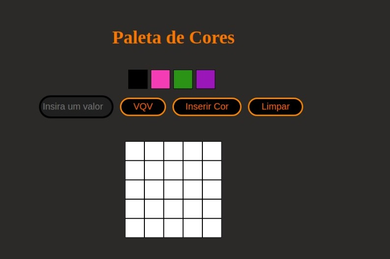
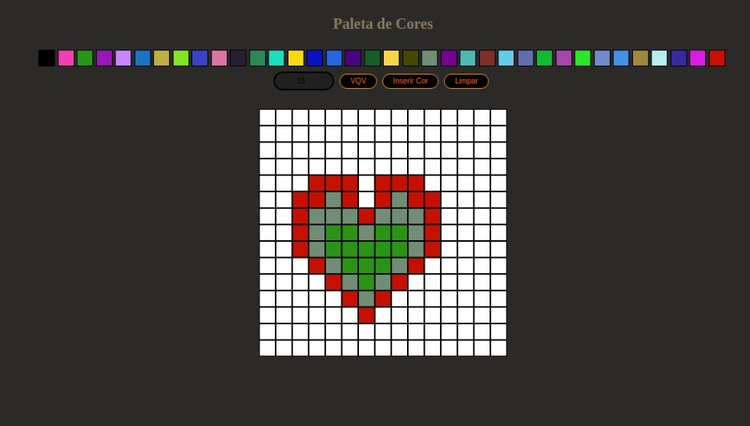

# ArteComPixels

Esse projetinho foi desenvolvido junto as aulas e aos requisitos dados pela trybe e foi entregue como desafio e para conclusao da unidade 5 da ementa. O PixelArt é um quadro interativo para preenchimentos de cores e formaçao de desenhos. Para isto foi utilizado JavaScript, CSS, HTML. E manipular DOM e JavaScript. Como a demonstraçao abaixo:

O projeto permite aumentar o grid de pixels até o maximo 50x50 e minimo 5x5, e gerar cores aleatorias para a criação da art.

